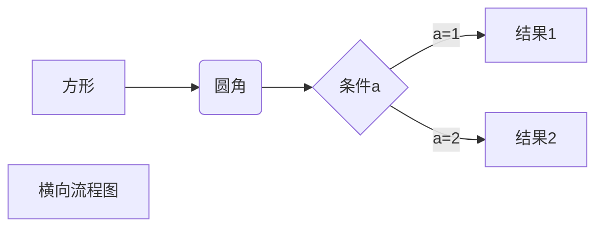
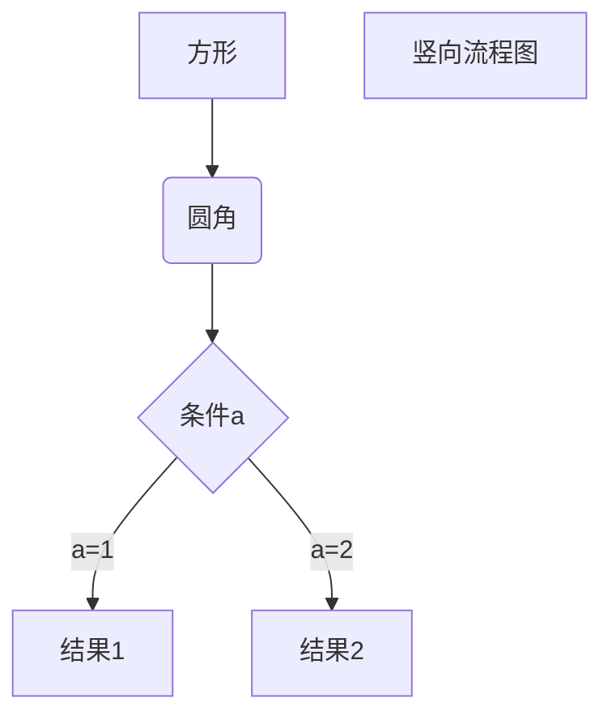
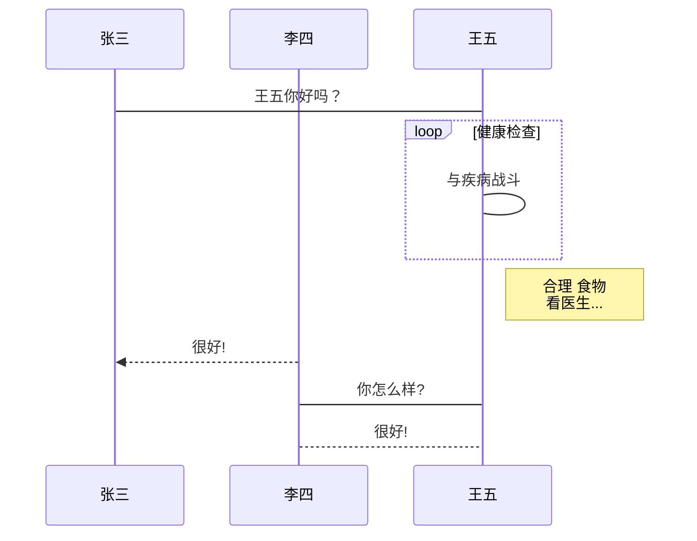
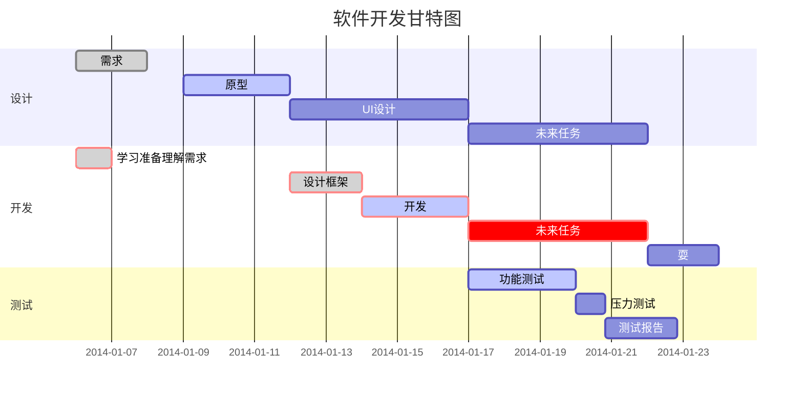

## 1、快速查看源代码

快捷键：crtl+/

## 2、标题

```Java
//标题一共有六个级别
# 一级标题
## 二级标题
### 三级标题
#### 四级标题
##### 五级标题
###### 六级标题
```

## 3、字体

```java
//粗体显示
**这里是粗体**
//删除线显示
~~这里是删除内容~~
//斜体显示
 *这里是斜体*
//粗斜体文本
***这里是粗斜体文本***
```

举例说明：

​ **这里是粗体**

​ ~~这里是删除线~~

​ _这里是斜体_

**_这里是粗斜体文本_**

## 4、引用

```Java
//这里显示的是引用，引用是有级别的
>一级引用
    >>二级引用，以此类推
//引用里面是可以添加列表元素的，也可以在列表元素里面加引用
```

> 这里是一级引用
>
> > 这里是二级引用
> >
> > 这里也是二级引用
> >
> > > 这里是三级引用
> > >
> > > 这里也是三级引用
> > >
> > > > 这是四级引用
> > > >
> > > > 这里也是可爱的四级引用

## 5、线

```java
//有三种种分割线
--- 这种分割线是根据内容来定的长度
*** 这种是全屏显示分割线的
___ 这种也可以作为分割线
//下划线
用html的<u></u>来表示下划线
//脚注
[^这里是脚注的内容]
```

---

---

---

---

<u>这里是下划线的内容</u>

这里要增加脚注[^这里是脚注的内容]

## 6、插入图片

```java
//图片可以是本地的，也可以是网络上的，网络上的图片在联网状态下可以显示，而本地的图片不能再网络上展示

//用img标签可以实现对图片设置大小
例如：
```


## 7、超链接

```java
//超链接在网页上是可以显示的，但是在这里是不能直接点击打开网页的，但是点击的时候会出现link，可以复制打开浏览器
[超链接的名字](链接的网页)
//这里也可以直接使用另外的链接方式
<这里是可爱的链接，缺点就是这里的链接不能定义别名>
//可以采用类似于脚注的方式来定义链接
其实是定义了一个变量，用来赋值
```

[百度](www.baidu.com)

<www.baidu.com>

这里我需要一个百度链接[百度][1]

## 8、有序和无序列表

```java
//无序列表
- 这里有一个空格的
* 这里也有一个空格
+ 这里也有一个空格
//有序列表，数字.
 1. 这里有一个空格
 2. 这里也有一个空格
类似于写文档一样的打开方式
//嵌套列表
在列表前面加空格，再加列表元素，其实写完之后，在文字后面加空格也可以达到这样的效果
```

- 这里是无序列表

- 这里也是无序列表

- 这里是加号的无序列表
- 这里也是加号的无序列表

* 这里是\*\*号的无序列表

1. 这里是有序的列表
2. 这里也是有序的

3. 这里可以实现有序列表吗

4. 这里要有空格才能实现
   - 这里是嵌套列表，前面有空格
   - 这里也是嵌套列表
   - 这里也是
     - 这里是第三层嵌套
       - 这里是第四层嵌套
         - 这里是第五层嵌套
         - 这里也是第五层嵌套

## 9、表格

```java
//别想这能打出表格，不信就自己打开源代码看看，要是你不嫌麻烦就好
//使用|来分割表单元格，用——分割表头
|  表头   | 表头  |
|  ----  | ----  |
| 单元格  | 单元格 |
| 单元格  | 单元格 |
//设置居中方式
 	-: 设置内容和标题栏居右对齐。
	:- 设置内容和标题栏居左对齐。
	:-: 设置内容和标题栏居中对齐。
//举个例子：
| 左对齐 | 右对齐 | 居中对齐 |
| :-----| ----: | :----: |
| 单元格 | 单元格 | 单元格 |
| 单元格 | 单元格 | 单元格 |
```

| 这里就是可爱的表格 | 为什么显示这么奇怪 |
| :----------------: | :----------------: |

## 10、行内代码和代码块

````java
//代码块，
​```对应代码的语言
//行内代码就是，这里可以有快捷键：ctrl+shift+反引号，可以实现在中文条件下直接调用反引号
`这里是行内代码`
````

`这里是行内代码`这里不是`行内代码

## 11、高级教程

#### 1、html

```java
不在 Markdown 涵盖范围之内的标签，都可以直接在文档里面用 HTML 撰写。
目前支持的 HTML 元素有：`<kbd> <b> <i> <em> <sup> <sub> <br>`等
 例如：ctrl+u
```

<u>这里是下划线</u>

#### 2、转义

```java
特殊符号前面加\可以显示转义字符
```

例如：\*

#### 3、数学公式

```java
当你需要在编辑器中插入数学公式时，可以使用两个美元符 $$ 包裹 TeX 或 LaTeX 格式的数学公式来实现。提交后，问答和文章页会根据需要加载 Mathjax 对数学公式进行渲染。
例如：
$$
\mathbf{V}_1 \times \mathbf{V}_2 =  \begin{vmatrix}
\mathbf{i} & \mathbf{j} & \mathbf{k} \\
\frac{\partial X}{\partial u} &  \frac{\partial Y}{\partial u} & 0 \\
\frac{\partial X}{\partial v} &  \frac{\partial Y}{\partial v} & 0 \\
\end{vmatrix}
${$tep1}{\style{visibility:hidden}{(x+1)(x+1)}}
$$
```

例如：

$$
\mathbf{V}_1 \times \mathbf{V}_2 =  \begin{vmatrix}
\mathbf{i} & \mathbf{j} & \mathbf{k} \\
\frac{\partial X}{\partial u} &  \frac{\partial Y}{\partial u} & 0 \\
\frac{\partial X}{\partial v} &  \frac{\partial Y}{\partial v} & 0 \\
\end{vmatrix}
${$tep1}{\style{visibility:hidden}{(x+1)(x+1)}}
$$

#### 4、流程图

````
//这个是横向代码格式
​```mermaid
graph LR
A[方形] -->B(圆角)
    B --> C{条件a}
    C -->|a=1| D[结果1]
    C -->|a=2| E[结果2]
    F[横向流程图]
​```
````



````
//这里是竖线流程图
​```mermaid
graph TD
A[方形] --> B(圆角)
    B --> C{条件a}
    C --> |a=1| D[结果1]
    C --> |a=2| E[结果2]
    F[竖向流程图]
​```
````



````
//这里是标准流 流程图
​```flow
st=>start: 开始框
op=>operation: 处理框
cond=>condition: 判断框(是或否?)
sub1=>subroutine: 子流程
io=>inputoutput: 输入输出框
e=>end: 结束框
st->op->cond
cond(yes)->io->e
cond(no)->sub1(right)->op
​```
````

```flow
st=>start: 开始框
op=>operation: 处理框
cond=>condition: 判断框(是或否?)
sub1=>subroutine: 子流程
io=>inputoutput: 输入输出框
e=>end: 结束框
st->op->cond
cond(yes)->io->e
cond(no)->sub1(right)->op
```

````
//这里是横向的标准流
​```flow
st=>start: 开始框
op=>operation: 处理框
cond=>condition: 判断框(是或否?)
sub1=>subroutine: 子流程
io=>inputoutput: 输入输出框
e=>end: 结束框
st(right)->op(right)->cond
cond(yes)->io(bottom)->e
cond(no)->sub1(right)->op
​```
````

```flow
st=>start: 开始框
op=>operation: 处理框
cond=>condition: 判断框(是或否?)
sub1=>subroutine: 子流程
io=>inputoutput: 输入输出框
e=>end: 结束框
st(right)->op(right)->cond
cond(yes)->io(bottom)->e
cond(no)->sub1(right)->op
```

````
//UML时序图
​```sequence
对象A->对象B: 对象B你好吗?（请求）
Note right of 对象B: 对象B的描述
Note left of 对象A: 对象A的描述(提示)
对象B-->对象A: 我很好(响应)
对象A->对象B: 你真的好吗？
​```
````

```sequence
对象A->对象B: 对象B你好吗?（请求）
Note right of 对象B: 对象B的描述
Note left of 对象A: 对象A的描述(提示)
对象B-->对象A: 我很好(响应)
对象A->对象B: 你真的好吗？
```

````
//UML时序图复杂样例
​```sequence
Title: 标题：复杂使用
对象A->对象B: 对象B你好吗?（请求）
Note right of 对象B: 对象B的描述
Note left of 对象A: 对象A的描述(提示)
对象B-->对象A: 我很好(响应)
对象B->小三: 你好吗
小三-->>对象A: 对象B找我了
对象A->对象B: 你真的好吗？
Note over 小三,对象B: 我们是朋友
participant C
Note right of C: 没人陪我玩
​```
````

```sequence
Title: 标题：复杂使用
对象A->对象B: 对象B你好吗?（请求）
Note right of 对象B: 对象B的描述
Note left of 对象A: 对象A的描述(提示)
对象B-->对象A: 我很好(响应)
对象B->小三: 你好吗
小三-->>对象A: 对象B找我了
对象A->对象B: 你真的好吗？
Note over 小三,对象B: 我们是朋友
participant C
Note right of C: 没人陪我玩
```

````
//这里是标准的uml图使用
​```mermaid
%% 时序图例子,-> 直线，-->虚线，->>实线箭头
  sequenceDiagram
    participant 张三
    participant 李四
    张三->王五: 王五你好吗？
    loop 健康检查
        王五->王五: 与疾病战斗
    end
    Note right of 王五: 合理 食物 <br/>看医生...
    李四-->>张三: 很好!
    王五->李四: 你怎么样?
    李四-->王五: 很好!
​```
````



````
//甘特图样例
​```mermaid
%% 语法示例
        gantt
        dateFormat  YYYY-MM-DD
        title 软件开发甘特图
        section 设计
        需求                      :done,    des1, 2014-01-06,2014-01-08
        原型                      :active,  des2, 2014-01-09, 3d
        UI设计                     :         des3, after des2, 5d
    未来任务                     :         des4, after des3, 5d
        section 开发
        学习准备理解需求                      :crit, done, 2014-01-06,24h
        设计框架                             :crit, done, after des2, 2d
        开发                                 :crit, active, 3d
        未来任务                              :crit, 5d
        耍                                   :2d
        section 测试
        功能测试                              :active, a1, after des3, 3d
        压力测试                               :after a1  , 20h
        测试报告                               : 48h
​```
````



[^这里是脚注的内容]: 为什么这里显示不出来，脚注不能放在前面吗

[1]: http://www.baudu.com/
